# PokeGET: A Pokémon Card Generator

A fun, retro-styled card generator web app to **search for and display Pokémon** data using the [PokéAPI](https://pokeapi.co/).
Built with HTML, CSS, and JavaScript, it combines a **Pokémon GO-inspired interface** with **Game Boy / Pokémon TCG aesthetics**.

<p align="center"></p>

---

## What it does

- **Search by Pokémon name** — Enter the name of any Pokémon and get its details instantly.
- **Search by type** — Enter a type (e.g., `fire`, `water`) to get a random Pokémon from that category.
- **Random Pokémon generator** — (hidden but coded) Generates a random Pokémon from all available generations.
- **Card generator with unique moves** — Each card contains different moves, creating unique variations.
- **Pokémon card view** — Shows:
  - Official sprite and type
  - HP, level, height, weight, and Pokédex number
  - Random moves and full list of abilities
- **Retro tables** — Lists **all moves** and **all abilities** in Game Boy–style tables.
- **Dynamic background** — Fills the page with a subtle Pokémon artwork background.
- **Pokémon cries** — Plays the Pokémon’s legacy cry when loaded.
- **Responsive design** — Works on desktop and mobile devices.

---

## Installation & Setup

1. **Clone this repository**
   ```bash
   git clone https://github.com/samarog/projects.git
   cd "29.1 pokeget"
   ```

2. **Open in your browser**
   - No build step needed — just open `app-v2.html` in your browser.
   - Or serve with a simple local server (optional):
     ```bash
     npx serve
     ```
     
---

## Tech Stack

- **HTML5** — Structure and markup
- **CSS3** — Styling, including:
  - Classic Game Boy table design
  - Pokémon TCG–style info cards
  - Gradient backgrounds and overlays
- **JavaScript (Vanilla)** — Fetches data from [PokéAPI](https://pokeapi.co/), handles events, and updates the DOM

---

## API Reference

- **Pokémon Data:** [`https://pokeapi.co/api/v2/pokemon/{name or id}`](https://pokeapi.co/api/v2/pokemon/)
- **Type Data:** [`https://pokeapi.co/api/v2/type/{type}`](https://pokeapi.co/api/v2/type/)
- **Sprites:** [Pokémon Sprites GitHub](https://github.com/PokeAPI/sprites)

---

## How It Works

```mermaid

flowchart TD
    A[User enters Pokémon name/type or clicks Random] --> B[JavaScript fetches data from PokéAPI]
    B --> C{Is query a Pokémon name?}
    C -- Yes --> D[Get Pokémon data from /pokemon/&#123;name&#125;]
    C -- No --> E[Fetch type data from /type/&#123;type&#125;]
    E --> F[Select random Pokémon from type list]
    F --> D
    D --> G[Parse stats, abilities, and moves]
    G --> H[Render retro Pokémon card and tables in DOM]
    H --> I[Play Pokémon cry]

```



---

## Credits

- **[PokéAPI](https://pokeapi.co/)** — for all Pokémon data and sprites.
- Pokémon GO logo — used for decorative purposes.
- Background sprites — official Pokémon artwork.
- Font — [Press Start 2P](https://fonts.google.com/specimen/Press+Start+2P) from Google Fonts.

---

### Author

Built by **Gonçalo Amaro**  
Twitter/X: [@gonsamaro](https://twitter.com/gonsamaro)  
GitHub: [samarog](https://github.com/samarog)

---

## License

This project is for educational and personal use.  
Pokémon and all related content are © Nintendo, Game Freak, and The Pokémon Company.
